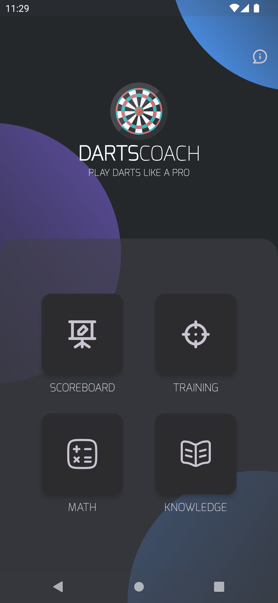
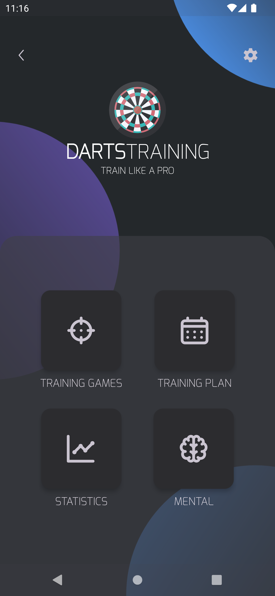
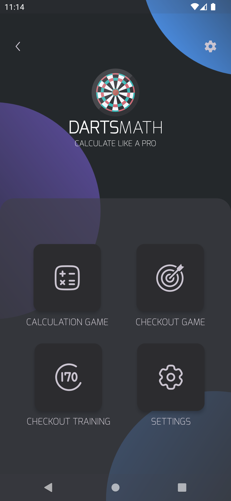

# Darts Coach
With Darts Coach you can improve your darts to score like a pro

# Current Version
* 0.0.1-m1-alpha (see [Changelog](CHANGELOG.md))

# Milestones
* M1 - Include DartsMath App into DartsCoach
* M2 - Finish Math 
* M3 - Finish Training
* M4 - Finish Knowledge
* M5 - Finish Scoreboard
* M6 - Play Store pre-release, closed testing
* M7 - Play Store pre-release, internal testing
* M8 - Play Store production release

# Features
* Scoreboard - Calculate your throwing dart scores
* Training - Improve your scoring or doubles or create a plan
* Math - Learn checkouts and calculate like a pro
* Knowledge - FAQ about darts

# Screenshots 
<table>
<tr>
<th>Startscreen</th>
<th>Scoreboard</th>
<th>Training</th>
<th>Math</th>
<th>Knowledge</th>
</tr>
<tr>
<td style="width: 25%"></td>
<td style="width: 25%">Scoreboard is in progress</td>
<td style="width: 25%"></td>
<td style="width: 25%"> </td>
<td style="width: 25%">Knowledge is in progress</td>
</tr>
</table>